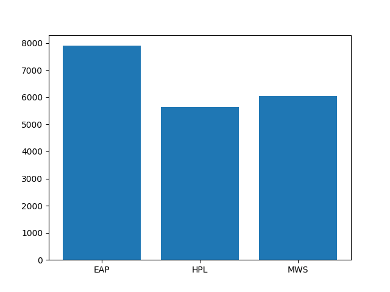
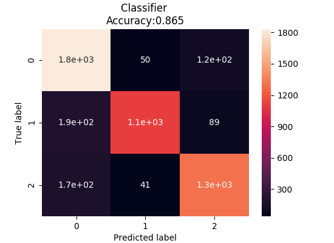

## Spooky-Classify ##
*Claire Pritchard*   
*January 2018*   

Text classification with scikit-learn and spaCy. This was used to identify the author 
and generate predictions for the [Kaggle Spooky Author Identification Competition](https://www.kaggle.com/c/spooky-author-identification),
December, 2017. The dataset consists of text written by Edgar Allan Poe, HP Lovecraft, and Mary Shelley.

The data files can be downloaded from [Kaggle](https://www.kaggle.com/c/spooky-author-identification/data).
Training data is in train.csv, and the test data set for generating predictions is in 
test.csv.

As you can see when plotting the distribution of author labels in the training dataset with matplotlib, there 
are quite a few more samples from Poe than from Lovecraft or Shelley. 
  
Rather than trying to find more Lovecraft and Shelley samples, I chose to resample using imbalanced-learn.

The model I finally arrived at is a VotingClassifier using as estimators the three classifiers with 
predict_proba support that had the highest accuracy. The VotingClassifier performed slightly better 
than the individual models, which were MultinomialNB, BernoulliNB, and MLPClassifier. 

Accuracy was also improved slightly by the addition of a few new features: sentence length
and standard deviation of the lengths of the words in the sentence. The sentences were tokenized
using spaCy.

After fitting the model, I got a score of 0.9988 on the training data and 0.8652 on the data 
held out for testing.

Making predictions for the held out test data resulted in the following confusion matrix and 
classification report and confusion matrix:
||precision|recall|f1-score|support|
|--|--|--|--|--|
|EAP|0.83|0.92|0.87|1999
|HPL|0.92|0.80|0.86|1388
|MWS|0.86|0.86|0.86|1508
|avg / total|0.87|0.87|0.86|4895                        
                       

